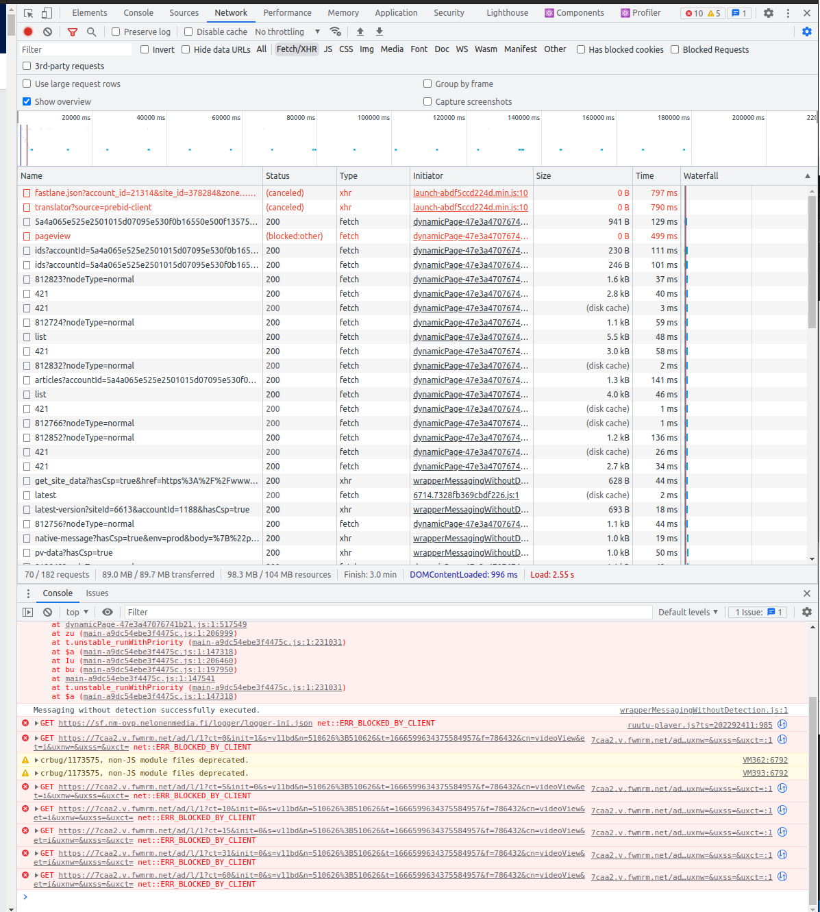
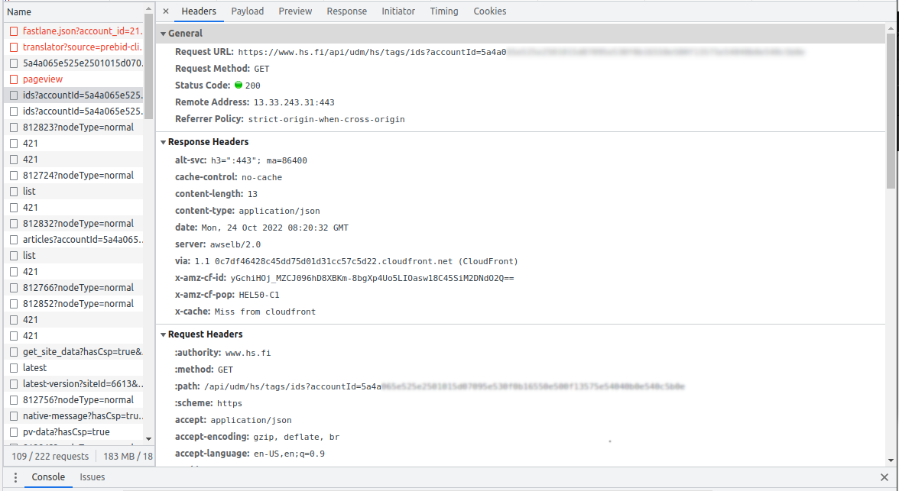

Harjoitus 0

Linkki tehtävänantoon: https://terokarvinen.com/2022/tunkeutumistestaus-ict4tn027-3010-syksylla-2022/

Tässä harjoituksessa seurasin Chromium-selaimen verkkoliikennettä www.hs.fi -osoitteeseen yhdistätteässä.

Selitteitä:

-Selain hakee sisältöä fetch-pyynnöillä tietoa palvelimilta.

-Osa pyynnöistä perutaan tai kielletään - käyttäjällä käytössä on mainostenesto-ohjelmisto

--Myös osa javascriptin suorittamista GET-pyynnöistä jätetään suorittamatta samasta syystä

Yksityiskohta:

Tämä pyyntö hakee käyttäjän itseasettamat tagit, joiden perusteella sivusto näyttää personoitua sisältöä. Tagit voivat olla esimerkiksi henkilöiden nimiä tai uutisen kategoria kuten "kotimaa".
Palvelin palauttaa tähän yksinkertaisen vastauksen:

        {"tagIds":[]}

Vastaus tarkoittaa, ettei käyttäjä ole asettanut yhtään seurattavaa tagia.