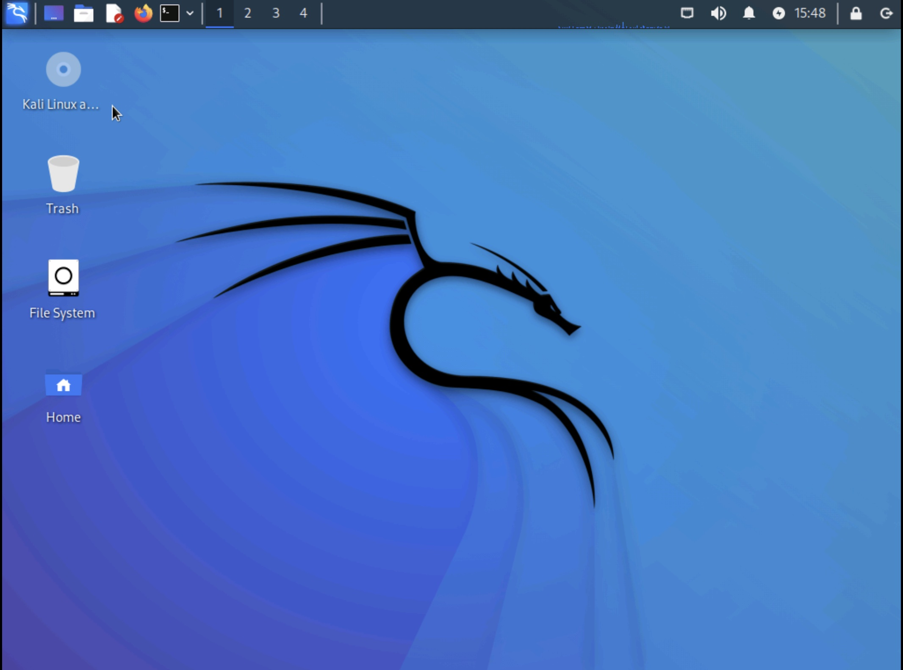

# h1
## x) 
Kuuntelin Darknet Diaries -podcastin jakson "77: Olympic Destroyer"

- Episodi kertoo vuoden Etelä-Korean järjestämien 2018 talviolympialaisten tietojärjestelmään kohdistuneesta verkkohyökkäyksestä
- Jaksossa on vieraana aihetta tutkinut journalisti Andy Greenberg
- Hyökkäyksessä käytettiin "olympic destroyer" -nimen saanutta haittaohjelmaa, jonka tarkoituksena oli varastaa käyttäjien tunnuksia ja salasanoja järjestelmästä
- Haittaohjelma oli kirjoitettu niin, että sen alkuperää oli vaikea selvittää, sillä siihen oli rakennettu lukuisia false flageja joilla yritettiin harhauttaa tutkijoita
- Useita false flageja: ohjelmaan oli rakennettu viitteitä mm. kiinalaisista ja pohjois-korealaisista hakkeriryhmistä
- Lopulta tietoturvayritys sai useiden johtolankojen kautta selville, että hyökkäysohjelman oli tuottanut hyvin todennäköisesti sama venäläinen hakkeriryhmä, joka oli hyökännyt Ukrainan infrastruktuuria vastaan
- Edellisissä talviolympialaisissa Venäjän Sochissa Venäjän joukkueen urheilijat voittivat useita kultamitaleita, ja jälkeenpäin tehty tutkinta osoitti että useita joukkueen dopingnäytteitä oli väärennetty. Tämän johdosta Venäjän valtion joukkueen urheilijoiden osallistuminen estettiin vuoden 2018 talviolympialaisissa.
- Etelä-Korean talviolympialaisten tietojärjestelmiin kohdistunut hyökkäys oli ilmeisesti venäläistä alkuperää - sen epäillään olleen kosto Venäjälle asetetuista kilpailukielloista. Venäjä on kieltänyt täysin olleensa osallisena hyökkäykseen.

## a) WebGoat -asennus 

- Asensin WebGoatin palvelimelleni virtuaalikoneelle, jonka käyttöjärjestelmä on Ubuntu Server. Käpälöin Ubuntu Server -konetta SSH-yhteyden yli omalta koneeltani. 
- Latasin WebGoatin ja asensin sopivan Java-version Teron ohjeiden mukaisesti.
- Ensin tarkistan palomuurin tilan ja sen jälkeen avaan  palomuurista sopivan portin WebGoatille (8080):

- Sen jälkeen käynnistän WebGoatin. WebGoat käynnistyy oletusasetuksilla vain localhostiin joten sille pitää antaa parametrinä serverin osoite, koska en käytä WebGoatia paikallisesti:

- Tämän jälkeen WebGoat löytyy lähiverkostani virtuaalikoneen ip-osoitteen alta ja pääsen kirjautumaan järjestelmään ongelmitta:

## b) WebGoat: HTTP Basics- ja Developer Tools -tehtävät

#### HTTP Basics
- Ensimäinen osa käsittelee http-pyyntöjä yleisesti ja antaa hyvät perustiedot tehtävien ratkaisuun. 

- Toisessa osassa tehdään yksinkertainen POST-pyyntö. Pyynnön sisältö ja vastaus on nähtävissä Chrome-selaimen developer tools -ominaisuudella:

- Kolmas osa vaatiikin jo pienimuotoista ongelmanratkaisua, kun ohjelma kysyy pyynnön tyypin lisäksi "magic numberia". Tehtävän voi ratkaista kahdella eri tavalla: lähettämällä sivun formin ilman "magic number" -kentän täyttämistä, jolloin "magic number" näkyy parametrina http POST -pyynnössä:

- Toinen tapa ratkaista tehtävä on tarkastella sivuston lähdekoodia, jolloin kovakoodattu "magic number" näkyy form-elementin parametrina:

### Developer tools
- Developer tools -tehtävissä käytetään Chromen developer tools -ominaisuutta tehtävien ratkaisemiseen. Tehtävän alussa selostetaan ja esitetään developer toolsin toiminnallisuuksia ja ominaisuuksia kattavasti.

- Neljännessä osan harjoituksessa ajetaan Chromen developer toolsin console -tabissa javascipt-funktio, jonka antama vastaus on vastaus tehtävään:

- Kuudennessa osiossa on tehtävä, jossa tarkastellaan erityistä HTTP requestia developer toolsin avulla. Kun käyttäjä painaa sivuston "GO!" -painiketta, sivusto tekee pyynnön, jonka sisältämä numerosarja on tehtävän vastaus:

Tehtävien suorittamisen jälkeen suljen avaamani portit Ubuntun palomuurista. En halua pitää avointa hyökkäysalustaa verkossani turhaan tarjolla.

## c) Over The Wire -tehtävät 0-2
### 0
Tehtävä 0:ssä pitää ensimäiseksi avata SSH-yhteys bandit.labs.overthewire.org -palvelimen porttiin 2220 käyttäjällä bandit0. Tämä onnistuu komennolla 

    ssh banti0@labs.overthewire.org -p 2220

Ensimäisen tason salasana on sama kuin käyttäjä: bandit0.

Tehtävässä on tarkoitus löytää tektitiedostoon tallennettu merkkijono, joka toimii seuraavalle tasolle salasanana. Tekstitiedoston nimi on `readme`, ja se löytyy käyttäjän kotihakemiston juuresta. Tekstitiedoston sisällön saa tulostettua konsoliin komennolla

    cat readme

Tämän jälkeen salasanan voi kopioida leikepöydälle ja käyttää sitä kirjautuakseen seuraavan tehtävän käyttäjällä samalle palvelimelle: 

        ssh banti1@labs.overthewire.org -p 2220

### 1
Tehtävä 1 on samankaltainen kuin tehtävä 0 - seuraavan tason salasana on piilotettu tekstitiedostoon, joka sijaitsee käyttäjän kotihakemiston juuressa. Tällä kertaa tiedosto on kuitenkin nimetty haastavasti, joten sen avaaminen vaatii hieman tietämystä unix-terminaalin käytöstä. Tiedoston nimi on tällä kertaa pelkkä väliviiva eli `-`.
Tiedoston voi tulostaa tehtävästä 0 tutulla `cat` -komennolla, mutta tässä tapauksessa annetaan myös tiedoston polku argumenttina, ei pelkkää tiedoston nimeä. Unix-maailmassa `./` viittaa aina työskentelyhakemistoon. Tiedoston sisältö saadaan näkyviin siis komennolla 

        cat ./-

### 2 
Tehtävä 2 jatkaa samalla mallilla: seuraavan tason salasana on tallennettu tiedostoon, mutta tiedoston nimi on tällä kertaa `spaces in this filename`. Välilyönnit tiedostonimissä aiheuttavat usein päänvaivaa. Tämä voidaan ratkaista käyttämällä ns. escape characteria eli kauttaviivaa: `\`, jonka jälkeen annetaan välilyönti.

Tiedosto saadaan siis näkyviin komennolla

        cat spaces\ in\ this\ filename

## d) Kali linux -asennus
Asensin Kali Linux -distron virtuaalikoneeseen. Asensin käyttöjärjestelmän käyttäen distron sivuilta löytyvää levykuvaa, jonka mounttasin virtuaalikoneeseen. Käytössäni on Asustor -levypalvelin, jonka virtualisointialusta tekee tästä operaatiosta helpon ja selkeän:

Itse graafinen asennuskäyttöliittymä ei toiminut, joten jouduin valitsemaan asennuksen aloitusvalikosta "Install". Toiminnallisuus on kuitenkin sama sekä graafisessa että rujomassa, tekstipohjaisessa käyttöliittymässä.

Asnnuksen configurointi oli yksinkertaista ja tuttua monen muun distron asennuksista. Itse asennuksessa meni huomattavan kauan - melkein kaksi tuntia. Syynä tähän on todennäköisesti levypalvelimeni virtualisointialusta. 

Kahvitauon ja juoksulenkin jälkeen distro oli asentunut, ja pääsin kirjautumaan sen työpöydälle ongelmitta:

Mitä tällä nyt tekisi?

## e) Challenge.fi -tehtävä
Päätin ratkaista tehtävän 2021: Encoding basics. Tehtävässä on annettu kryptattu merkkijono, johon on mitä ilmeisimmin piiloitettu tehtävän ratkaisu.

Etsin verkosta työkaluja, joilla voisin tarkastaa millä tekniikalla merkkijono on kryptattu. Löysin sivuston https://multiencoder.com/.
Kokeilin kaikki mahdolliset dekryptausvaihtoehdot läpi, kunnes vastaus oli selkokielinen: merkkijono oli kryptatty BAS64-tekniikalla:

Vuoden 2021 tehtävien sivusto lienee hajonnut, sillä ratkaisusta ei tullut mitään palautetta :/
