# h2
## a) Metasploitable 2 asennus

Asensin Metasploitable 2:n virtuaalikoneeseen. Loin Virtualboxissa yhteisen virtuaaliverkon Kali Linuxia pyörittävää virtuaalikonetta ja Metasploitablea varten.

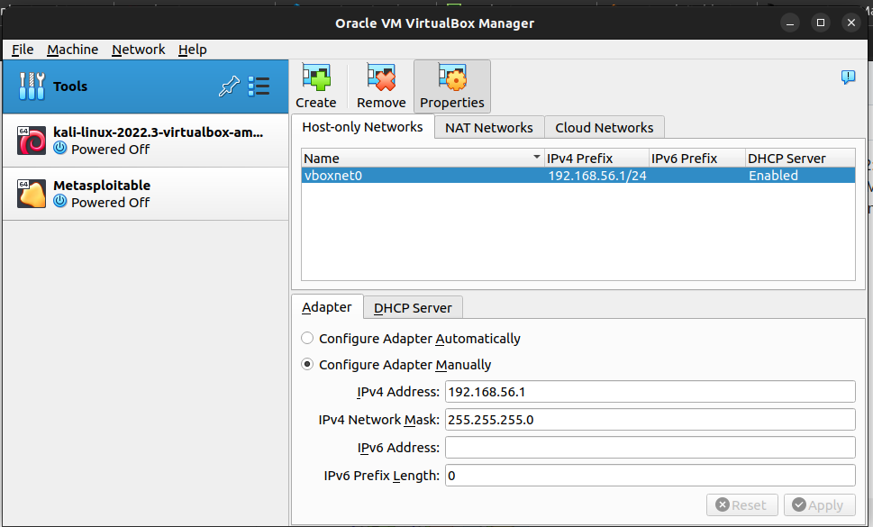

Tämän jälkeen kytkin molemmat virtuaalikoneet luomaani virtuaaliverkkoon.

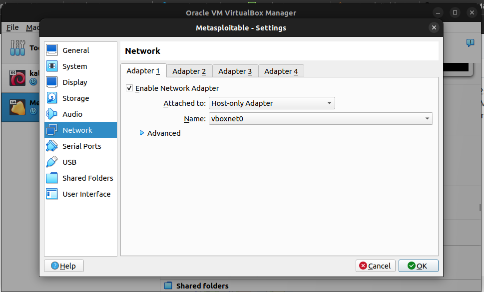

Käynnistin molemmat virtuaalikoneet, ja siirryin tarkistamaan että koneilla ei ole yhteyttä ulkoverkkoon.

Kali linuxilla oli käytössä myös ulkoverkkoon yhdistyvä verkkokortti (eth0), joten se piti ottaa pois käytöstä. Jätin käyttöön vain verkkokortin nimeltä eth1, joka oli yhdistety ainoastaan pystyttämääni virtuaaliverkkoon.

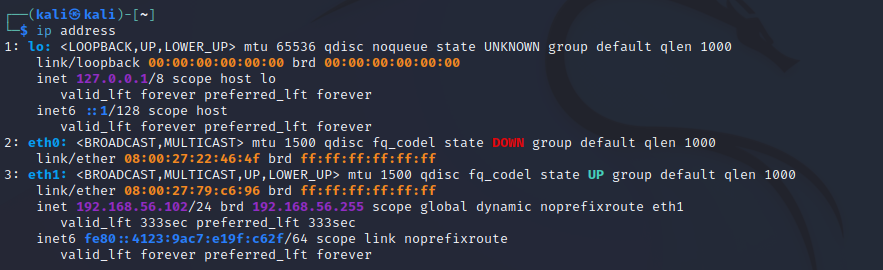

Tämän jälkeen tarkistin että Metasploitable 2 -kone oli samassa verkossa Kalin kanssa.

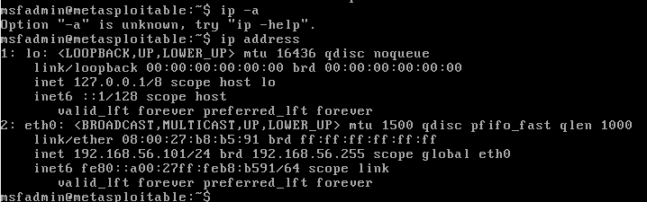

...ja varmistin että kone on todellakin suljettu ulkoverkosta pingaamalla Googlen nimipalvelinta.


## b) Metasploitable 2:n skannaus

Koska tiesin jo Metasploitable 2 -koneeni ip-osoitteen, en ruvennut skannaaman lähiverkkoa sen enempää. 
Siirryin suoraan Metasploitable 2 -koneen porttien skannaukseen Kali Linuxissa. 

Käynnistin Metasploitin komennolla `sudo msfdb run`. Olin jo aikaisemmin luonut tietokannan Metasploitille, joten sitä ei tarvinnut enää tehdä.

Aloitin porttiskannauksen nmapilla. Annoin nmapille argumentiksi `-sV`, joka pyrkii löytämään avoimessa portissa asustavan palvelun version. Käytin myös argumenttia `--script=banner`, joka on nmapin oma yksinkertainen banner grabber -scripti. Banner grabber -scripti yhdistää avoimeen porttiin ja kuuntelee sen vastausta oletusasetuksella 5 sekuntia.
```
exec: nmap -sV --script=banner 192.168.56.101

Starting Nmap 7.92 ( https://nmap.org ) at 2022-11-05 16:10 EDT
mass_dns: warning: Unable to determine any DNS servers. Reverse DNS is disabled. Try using --system-dns or specify valid servers with --dns-servers
Nmap scan report for 192.168.56.101
Host is up (0.00028s latency).
Not shown: 977 closed tcp ports (reset)
PORT     STATE SERVICE     VERSION
21/tcp   open  ftp         vsftpd 2.3.4
|_banner: 220 (vsFTPd 2.3.4)
22/tcp   open  ssh         OpenSSH 4.7p1 Debian 8ubuntu1 (protocol 2.0)
|_banner: SSH-2.0-OpenSSH_4.7p1 Debian-8ubuntu1
23/tcp   open  telnet      Linux telnetd
|_banner: \xFF\xFD\x18\xFF\xFD \xFF\xFD#\xFF\xFD'
25/tcp   open  smtp        Postfix smtpd
|_banner: 220 metasploitable.localdomain ESMTP Postfix (Ubuntu)
53/tcp   open  domain      ISC BIND 9.4.2
80/tcp   open  http        Apache httpd 2.2.8 ((Ubuntu) DAV/2)
|_http-server-header: Apache/2.2.8 (Ubuntu) DAV/2
111/tcp  open  rpcbind     2 (RPC #100000)
| rpcinfo: 
|   program version    port/proto  service
|   100000  2            111/tcp   rpcbind
|   100000  2            111/udp   rpcbind
|   100003  2,3,4       2049/tcp   nfs
|   100003  2,3,4       2049/udp   nfs
|   100005  1,2,3      38934/udp   mountd
|   100005  1,2,3      56689/tcp   mountd
|   100021  1,3,4      44024/tcp   nlockmgr
|   100021  1,3,4      44754/udp   nlockmgr
|   100024  1          40622/tcp   status
|_  100024  1          45526/udp   status
139/tcp  open  netbios-ssn Samba smbd 3.X - 4.X (workgroup: WORKGROUP)
445/tcp  open  netbios-ssn Samba smbd 3.X - 4.X (workgroup: WORKGROUP)
512/tcp  open  exec        netkit-rsh rexecd
|_banner: \x01Where are you?
513/tcp  open  login       OpenBSD or Solaris rlogind
514/tcp  open  shell       Netkit rshd
|_banner: \x01getnameinfo: Temporary failure in name resolution
1099/tcp open  java-rmi    GNU Classpath grmiregistry
1524/tcp open  bindshell   Metasploitable root shell
|_banner: root@metasploitable:/#
2049/tcp open  nfs         2-4 (RPC #100003)
2121/tcp open  ftp         ProFTPD 1.3.1
|_banner: 220 ProFTPD 1.3.1 Server (Debian) [::ffff:192.168.56.101]
3306/tcp open  mysql       MySQL 5.0.51a-3ubuntu5
| banner: >\x00\x00\x00\x0A5.0.51a-3ubuntu5\x00\x08\x00\x00\x00gYdnz=\9\x
|_00,\xAA\x08\x02\x00\x00\x00\x00\x00\x00\x00\x00\x00\x00\x00\x00\x00\...
5432/tcp open  postgresql  PostgreSQL DB 8.3.0 - 8.3.7
5900/tcp open  vnc         VNC (protocol 3.3)
|_banner: RFB 003.003
6000/tcp open  X11         (access denied)
6667/tcp open  irc         UnrealIRCd
| banner: :irc.Metasploitable.LAN NOTICE AUTH :*** Looking up your hostna
|_me...\x0D\x0A:irc.Metasploitable.LAN NOTICE AUTH :*** Couldn't resol...
8009/tcp open  ajp13       Apache Jserv (Protocol v1.3)
8180/tcp open  http        Apache Tomcat/Coyote JSP engine 1.1
|_http-server-header: Apache-Coyote/1.1
MAC Address: 08:00:27:B8:B5:91 (Oracle VirtualBox virtual NIC)
Service Info: Hosts:  metasploitable.localdomain, irc.Metasploitable.LAN; OSs: Unix, Linux; CPE: cpe:/o:linux:linux_kernel

Service detection performed. Please report any incorrect results at https://nmap.org/submit/ .
Nmap done: 1 IP address (1 host up) scanned in 26.93 seconds
```

Koska Metasploitable 2 on haavoittuvaksi rakennettu alusta, siihen on asennettu monia palveluita, jotka näkyvät porttiskannauksessa. Kaikista porteista saamme selville palvelun nimen ja version, sekä banner grabin tuloksen. Banner sisältää yleisesti portissa majailevan palvelun nimen ja version. Palveluiden versiotieto on erityisen tärkeää, sillä sen perusteella voimme etsiä Internetistä haavoittuvuuksia ja kohdistaa hyökkäyksemme versiokohtaista haavoittuvuutta vastaan. 

Haluan tallentaa skannauksen tulokset Metasploitin tietokantaan, ja luon sitä varten itselleni workspacen eli työtilan Metasploitiin. Tämä tapahtuu Metasploitin konsolissa komennolla `workspace -a {workspacen nimi}`. Komento `workspace` näyttää käytettävissä olevat ja käytössä olevan työtilan. 
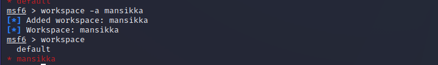

Tallennan nmap-tulokset kantaan komennolla `db_nmap {ip-osoite}`. Ohjelma skannaa kohdekoneen uudestaan ja tallentaa tulokset tietokantaan.
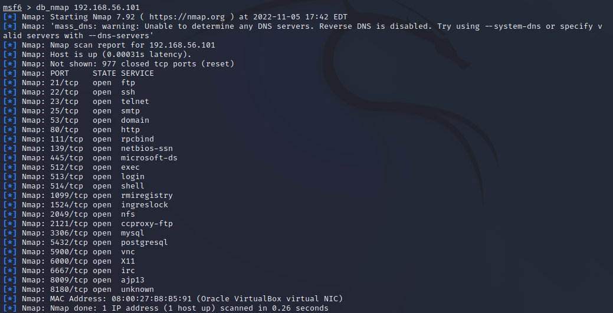


Skannauksen tulokset ovat nyt helposti saatavilla esimerkiksi komennolla `services` joka listaa kaikki skannauksen tuloksena saadut avoimet palvelut.
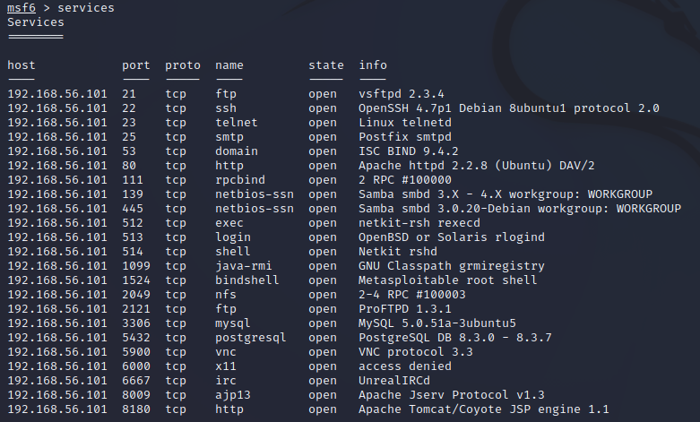


## c) Metasploitable 2:n murtautuminen: PostgreSQL

Valitsin ensimäiseksi hyökkäyskohteekseni Metasploitablen PostgreSQL-palvelun. Valitsin kyseisen tietokantapalvelun siksi, että olen työelämässä hallinnoinut PostgreSQL-tietokantoja mutta en ole koskaan kohdannut yhtäkään murtautumisyritystä tätä palvelua kohtaan.

Metasploitablessa on valmiina tietokanta hyökkäyksistä, joita ohjelmassa on helppo käyttää. Komento `search` etsii Metsaploitin tietokannasta vapaasanahaulla hyökkäyksiä. 
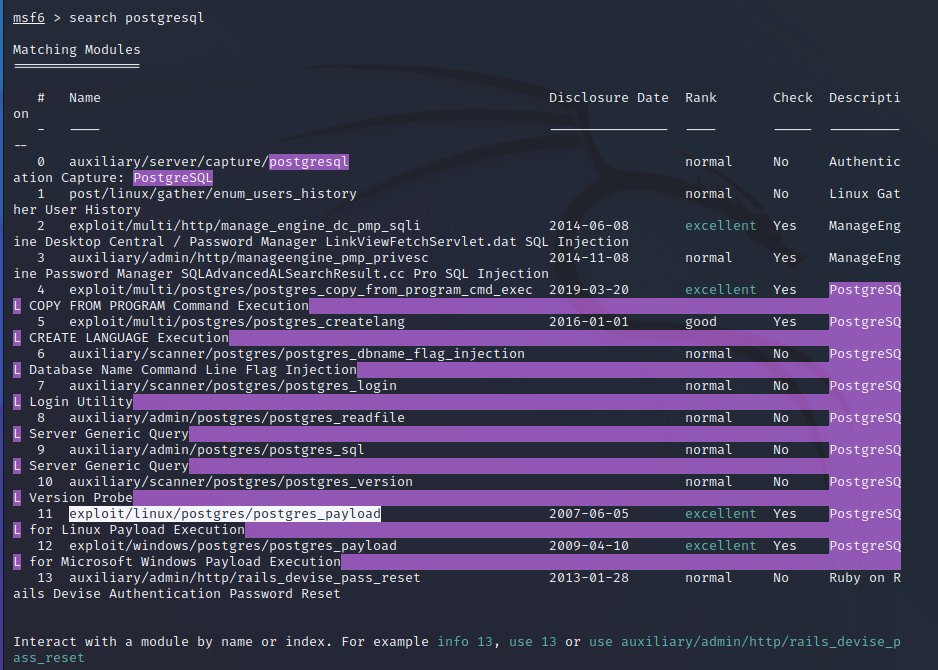

Valitseni hyökkäykseksi 11: `exploit/linux/postgres/postgres_payload`. Löysin kuvauksen hyökkäyksestä täältä: https://www.infosecmatter.com/metasploit-module-library/?mm=exploit/linux/postgres/postgres_payload

Hyökkäys mahdollistaa ulkopuolisen koodin suorittamisen, ja tätä kautta mahdollisesti suoran yhteyden palvelimen komentotulkkiin.

Otan em. exploitin käyttöön komennolla `use {exploitin nimi}`
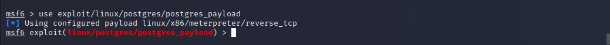

Kun hyökkäys on alustettu, komento `show payloads` näyttää kaikki exploitiin soveltuvat payloadit.

Komento `options` näyttää exploittikohtaiset asetukset. Asetuksista selviää, että käytössä on payload nimeltään `linux/x86/meterpreter/reverse_tcp`. 
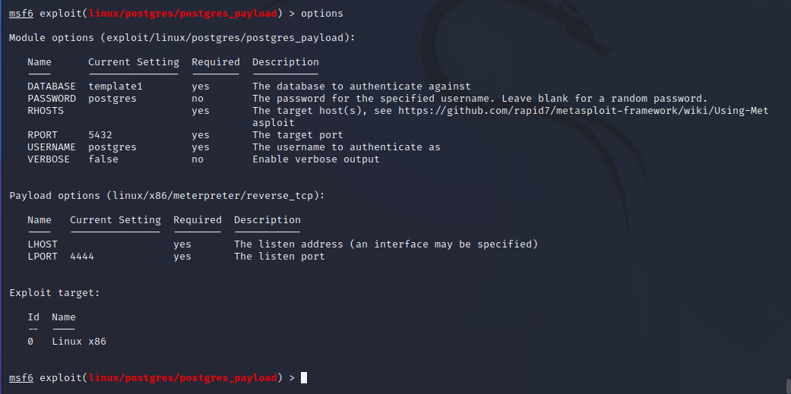

Seuraavaksi asetan Metasploitable 2 -koneen kohteeksi hyökkäyksellemme. Tämä tapahtuu komennolla `set RHOSTS {kohde}`

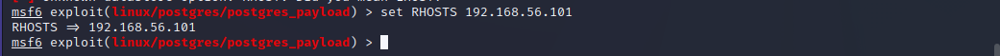

Tämän jälkeen voin aloittaa hyökkäyksen. Tämä tapahtuu komennolla `exploit`.

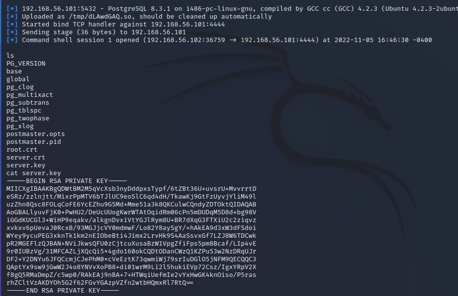

Hyökkäys onnistuu, ja saan hallintaani komentotulkin kohdekoneella. Pääsen lukemaan tiedostoja ja navigoimaan tiedostojärjestelmässä.

## d) Metasploitable 2:n murtautuminen: ProFTPD

Seuraavaksi päätin kokeilla palvelimen ProFTPD -palveluun murtautumista. Noudatin samaa kaavaa hyökkäyksen alustamisessa kuin edellisessä, mutta unohdin tarkastaa exploitin asetuksista sopivan payloadin. 


Kokeilin muutamaa eri payloadia, mutta hyökkäys ei onnistunut.
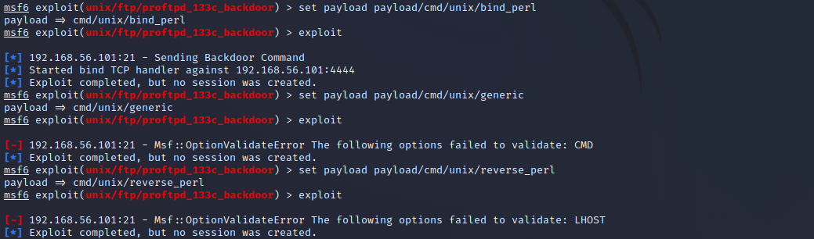

Viimein sain yhteyden auki, mutta se kaatui miltei heti aukeamisen jälkeen. Sain kirjoitettua kuitenkin kirjoitettua tiedoston, joka näkyi Metasploitable 2 -koneen juuressa.

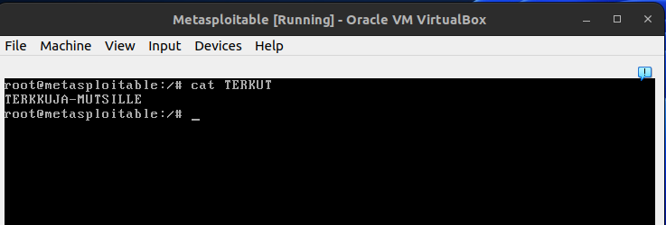


## e) Vulnhub -kone: Evilbox one

Päätin kokeilla murtautua Vulnhubin Evilboxe one -koneeseen. Pystytin lataamani virtuaalikoneen samaan verkkoon Kali Linuxin ja Metasploitable 2:n kanssa.
`nmap` koko lähiverkolle kertoi, että kone oli toiminnassa ja oli saanut verkkoyhteyden. nmap ei kuitenkaan kertonut, mitä palveluita avoimissa porteissa oli, joten päädyin ajamaan saman komennon kuin ensimäistä kertaa metasploitable 2:sta skannatessani, eli `nmap -sV --script=banner {kohde}`.

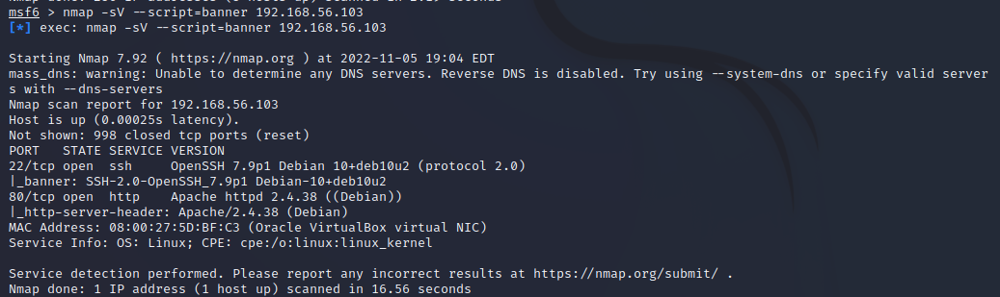

Seuraavaksi halusin tallentaa nmapin tulokset metasploitin kantaan. `db_nmap` ei kuitenkaan tallentanut palveluiden nimiä ja versioita:


Ajoin `db_nmap -sV` ja palvelut näkyivät nyt kannassa.


Porttiskannauksen tuloksena selviää, että koneen käyttöjärjestelmä on  Debian Linux ja se pyörittää Apache -web-palvelinta. Pikainen vierailu koneen osoitteessa Firefoxilla todentaa tämän:

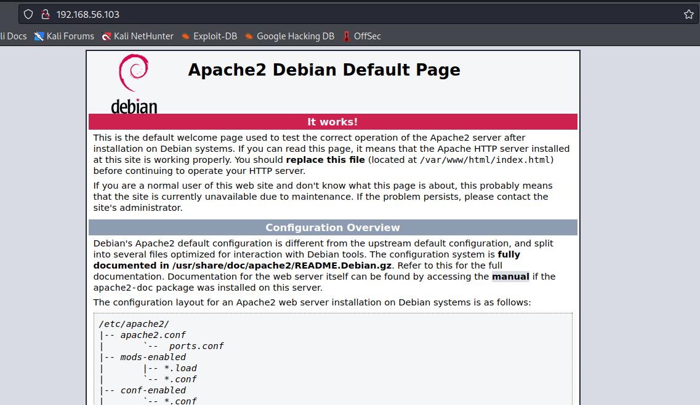


Olen joskus lukenut ohimennen verkkosivujen skannauksesta bruteforce-wordlist -työkaluilla. Pienen kaivelun jälkeen selvisi että Kali Linuxissa on valmiina dirb, joka tekee juuri tämän: se etsii oman sanakirjastonsa perusteella hakemistoja ja tiedostoja verkkosivulta. Komento `dirb {verkko-osoite}` tulostaa seuraavaa:
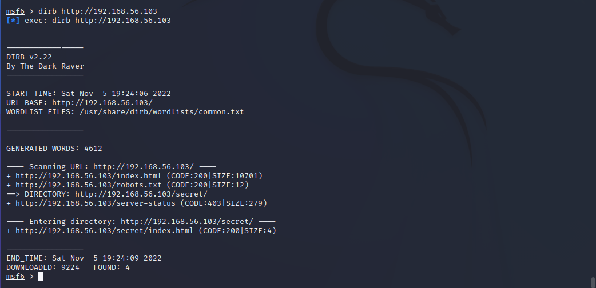

dirbin löytämä, hämmentävän kiusallisesti nimetty 'secret' -hakemisto kiinnostaa, ja päätän kurkistaa sinne selaimen avulla. Sivu on tyhjä eikä dev-tabin verkkoliikenteessä näy mitään erikoista.

Päätän jättää yrityksen toiseen kertaan. Tämän ratkaisu vaatinee vielä opiskelua.


## Lähteet:

-https://www.infosecmatter.com/metasploit-module-library/?mm=exploit/linux/postgres/postgres_payload

-https://nmap.org/nsedoc/scripts/banner.html

-https://nmap.org/book/man-port-scanning-techniques.html

-https://nmap.org/book/man-version-detection.html

-https://www.geeksforgeeks.org/what-is-banner-grabbing/

-https://vulnhub.com/entry/evilbox-one,736/

-https://www.kali.org/tools/dirb/

