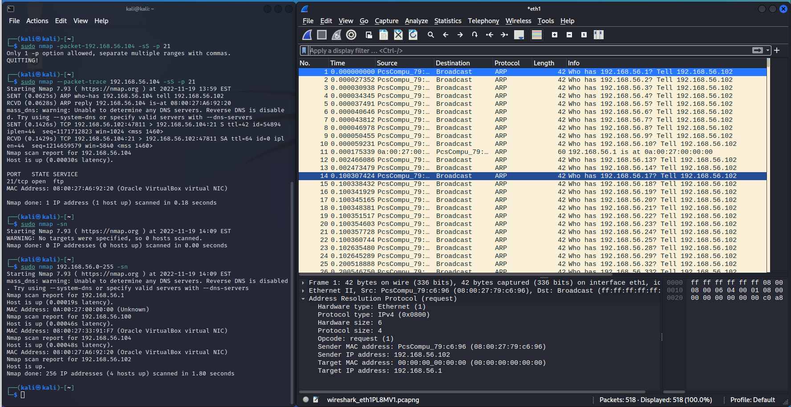
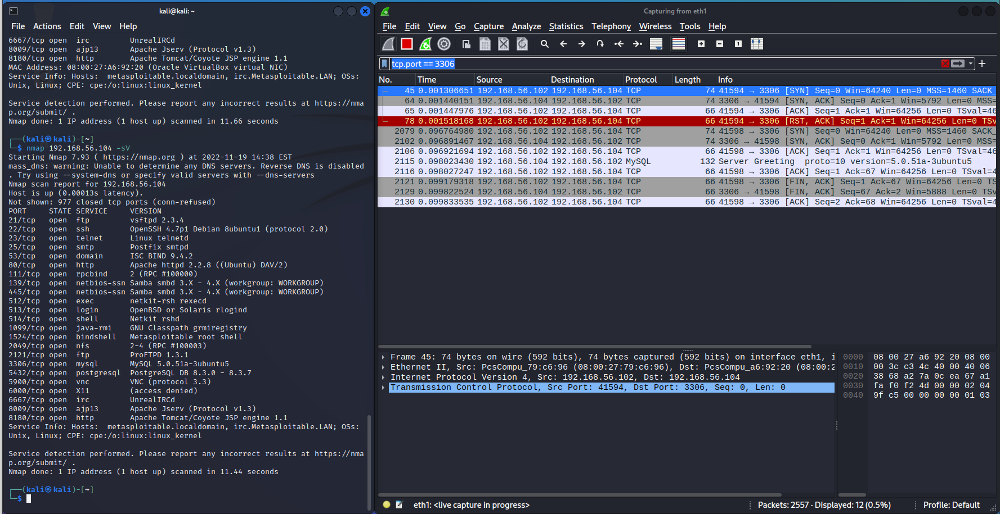

# h4

## z)

### Santos et al: The Art of Hacking (Video Collection): [..] 4.3 Surveying Essential Tools for Active Reconnaissance
- Videoissa käydään läpi porttiskannauksen periaatteet ja siihen käytettäviä työkaluja kuten nmap ja masscan

- Kattavasti esitelty ohjelmien käyttöä ja parametreja

- Udpprotoscanner: TCP on yleisin skannattu porttityyppi, ja UDP on harvemmin käytetty vaikka se saattaa paljastaa paljon hyödyllistä informaatiota

- EyeWitness: työkalu hyökkäyskohteiden luokitteluun: ottaa screenshotin verkkosivusta ja koostaa kohteista raportin

### Lyon 2009: Nmap Network Scanning: Chapter 1. Getting Started with Nmap
Ensimäinen tarina on hyvä esimerkki nmapin käytöstä kuvitteellisessa skenaaroissa
- Tarina kertoo henkilöstä, joka toimii penetraatiotestaajana yrityksessä, joka saa asiakkaakseen ison pelistudion
- - Erittäin hyvä kuvaus nmapin käytöstä todellisessa hyökkäkysessä
 - - Tuloksia on analysoitu kattavasti ja käytetyt parametrit on selitetty erittäin hyvin

Toinen tarina kertoo Matrix Reloaded -elokuvan kohtauksesta, jossa hahmo käyttää nmappia hakkeroinnissaan.

Kolmas talina esittelee todellisen skenaarion
    - Kirjoittajalle oli annettu vastuu yrityksen koko verkkoavaruuden monitoroinnista
    - Yrityksessä oli ~50 000 konetta
    - Kirjoittaja käyttää nmappia skannatessaan verkkoa
    - Hän rakentaa työkalun, joka skannaa verkkoa aika ajoin, tallentaa tulokset tietokantaan ja ilmoittaa muutoksista

## nmap.org - Port Scanning Basics
### Nmapin avoimien porttien tilat
- open: avoin portti, joka voi vastaanottaa yhteyksiä
- closed: portti, joka on auki mutta sitä ei kuuntele mikään ohjelma
- filtered: nmap ei pysty päätttelemään onko portti auki koska pakettisuodatus estää portin probaamisen
- unfiltered: portti on näkyvissä, mutta nmap ei pysty päättelemään onko portti auki vai kiinni
- open|filtered: nmap ei pysty päättelemään onko portti auki vai `filtered`
- closed|filtered: nmap ei pysty päättelemään onko portti suljettu vai `filtered`

## nmap.org - Porrt Scanning Techniques:
`-sS` (TCP SYN scan):
    
- Yleisin ja oletusskkannaus
- Nopea: jopa tuhansia portteja / sekunti
- Yleisesti luotettavin
- Ns. "half-open scanning": skannaus ei avaa täyttä TCP-yhteyttä. Skannaus lähettää SYN-paketin ja odottaa vastausta, mutta ei avaa yhteyttä kokonaan.

`-sT* (TCP Connect Scan):
    
- Kun SYN scan ei ole mahdollista, TCP Connect Scan on seuraava vaihtoehto
- 

## Nmap -testejä ja kokeiluja

### a) nmap TCP connect scan -sT

Ajan komennon `nmap 192.168.56.104 -sT`. Nmap lähettää SYN-paketteja 1000 yleisimpään portiin, ja tarkastelee vastausta päätelläkseen, onko kohdeportissa jokin palvelu. Katselen wiresharkilla liikennettä skannauksen aikana:

Porttiskannauksen tuloksista näen avoimet portit ja niissä mahdollisesti majailevat palvelut:

    ──(kali㉿kali)-[~]
    └─$ nmap 192.168.56.104 -sT
    Starting Nmap 7.93 ( https://nmap.org ) at 2022-11-19 13:21 EST
    mass_dns: warning: Unable to determine any DNS servers. Reverse DNS is disabled. Try using --system-dns or specify valid servers with --dns-servers
    Nmap scan report for 192.168.56.104
    Host is up (0.00029s latency).
    Not shown: 977 closed tcp ports (conn-refused)
    PORT     STATE SERVICE
    21/tcp   open  ftp
    22/tcp   open  ssh
    23/tcp   open  telnet
    25/tcp   open  smtp
    53/tcp   open  domain
    80/tcp   open  http
    111/tcp  open  rpcbind
    139/tcp  open  netbios-ssn
    445/tcp  open  microsoft-ds
    512/tcp  open  exec
    513/tcp  open  login
    514/tcp  open  shell
    1099/tcp open  rmiregistry
    1524/tcp open  ingreslock
    2049/tcp open  nfs
    2121/tcp open  ccproxy-ftp
    3306/tcp open  mysql
    5432/tcp open  postgresql
    5900/tcp open  vnc
    6000/tcp open  X11
    6667/tcp open  irc
    8009/tcp open  ajp13
    8180/tcp open  unknown

    Nmap done: 1 IP address (1 host up) scanned in 0.09 seconds

Valitsen avoimen portin 21 tarkasteluni kohteeksi wiresharkissa:

Wiresharkin logista näkyy seuraavat vaiheet:
    
1. Hyökkäyskone lähettää SYN-paketteja kohteeseen
2. Kohdekone vastaa SYN, ACK -paketeilla 
3. Hyökkäyskone lähettää ACK kohdekoneelle
4. Hyökkäyskone lähettää RST, ACK kohdekoneelle

SYN -> SYN ACK -> ACK on TCP-yhteyden kolmivaiheinen kättely, ja RST on yhteyden katkaisu.

### b) nmap TCP SYN "used to be stealth" scan, -sS

 Tällä kertaa nmap pitää ajaa sudona, sillä `-sS` -flagilla ajettuna se käytä käyttöjärjestelmän omaa protokollaa portteihin yhdistämisessä. Tällä kertaa nmap luo itse SYN-paketit.

 Tällä kertaa yhteyden kulku on SYN -> SYN ACK -> RST.

 Ajan komennon `sudo nmap 192.168.56.104 -sS` ja tarkkailen liikennettä wiresharkilla:
 
 

Porttiin 21 kohdistuvaa likkennettä erittelemällä näen että yhteyden kulku todellakin on erilainen:

### c) nmap ping sweep -sn 

nmap -sn -komento käyttää ARP-protokollaa löytääkseen verkosta isäntäkoneita. ARP-protokolla 1970-luvun lopulla kehitetty protokolla verkkoinfrastruktuurin ymmärtämiseen. Käytännössä ARP sitoo isäntäkoneen MAC-osoitteen verkon ip-osoitteeseen.

Ajan komennon `sudo nmap 192.168.56.104 -sS` ja tarkastelen liikennettä wiresharkilla:

Wiresharkin logista selviää että hyökkäyskone lähettää ARP-kyselyitä. Nmap poimii kyselyihin vastaavien koneiden MAC-osoitteet ja tulkitsee kyselyyn vastaavan koneen olevan elossa.

### d) nmap don't ping -Pn

`nmap -Pn` on käytännössä sama kuin `-st` -flagilla ajettu komento, mutta yhdellä eroavaisuudella: jos ARP-kutsuun vastannut eli verkosta löytyvä isäntäkone ei vastaa ping-kutsuun, nmap jättää kyseisen kohteen kokonaan skannaamatta. (https://nmap.org/book/man-host-discovery.html)

### e) nmap version detection -sV

`nmap -sV` pyrkii selvittämään skannauksen ohessa kohdekoneen avoimissa porteissa majailevat palvelut ja niiden versiot. Tämä tapahtuu probettamalla porttia yleisesti käyttävien palveluiden kutsuilla, ja jos nmap saa vastauksen, se tulkitsee palvelun nimen ja version vastauksen perusteella. (https://nmap.org/book/vscan.html)

Ajan hyökkäyskoneellani `sudo nmap 192.168.56.104 -sV` ja monitoroin samalla liikennettä Wiresharkilla. Screenshotissa eriteltynä portista 3306 löytyvä MySQL -palvelu:

### f) nmap porttien valinta -p1-100, --top-ports 5, -p-

- `nmap {host/range} -p1-100` skannaa vain portit 1-100. `-p` -flagilla voidaan siis määrittää, mitä portteja skannataan spesifisesti
- `nmap {host/range} --top-ports` skannaa viisi yleisintä avointa porttia, jotka ovat 21,22,23,80 ja 443. Vaihtoehtoinen flagi on -F (=fast), joka skannaa 100 yleisintä porttia.
- `nmap {host/range} -p-` skannaa kaikki mahdolliset portit eli 1-65535. 

(https://nmap.org/book/port-scanning-options.html)

### g) ip-osoitteiden valinta

Yleisin tapa skannata kohde tai verkko on antaa suora osoite tai osoiteavaruus skannaukselle. nmapissa kohteen osoitteen voi määritellä monella eri tavalla.

(https://nmap.org/book/man-target-specification.html)

#### Verkkomaskilla:
- Verkkomaskia voidaan käyttää ip-osoitten lähteenä nmapille, esimerkiksi `nmap 192.168.56.0/24`:

#### Ip-osoitealueena

- Syntaksi: `nmap ip-osoitealueen alku {viiva} ip-osoitealueen loppu`
- Esimerkiksi `nmap 192.168.56.0-255` tuottaa saman tuloksen kun ylempi kuva

#### Luettelona

- Ulkopuolinen tiedosto, jossa lista ip-osoitteita
- Esimerkiksi verkon skannauksesta saatujen isäntäkoneiden ip-osoitteita
- Syntaksi: `nmap -iL {tiedosto}`

        
        
        Lukiessani dokumentaatiota aiheesta silmääni osui eräs nmapin erikoinen toiminnallisuus: mahdollisuus skannata täysin satunnaisia verkko-osoitteita: komento `nmap -iR {skannattavien osoitteiden määrä}` arpoo osoitteita mielivaltaisesti. En oikein näe mitään järkevää käyttöä tälle ominaisuudelle.

### h) nmap -oA

nmapissa on mahdollisuus tallentaa skannauksen tulokset tiedostoon. Tiedoston formaatin voi valita neljästä eri vaihtoehdosta omilla vipukomennoillaan, tai tallentaa tulokset kaikkiin kolmeen yleisimpään formaattiin yhdellä komennolla. `nmap -help`:n mukaan tiedostomuodot ovat:

        OUTPUT:
     -oN/-oX/-oS/-oG <file>: Output scan in normal, XML, s|<rIpt kIddi3,
     and Grepable format, respectively, to the given filename.

Kokeilen tallentaa yhden kohteen skannauksen tulokset  kolmeen yleisimpään tiedostomuotoon komennolla `nmap 192.168.56.104 -sV -oA ./nmap-log/tulokset`. Tämän jälkeen skannauksen tulokset löytyvät nmap-log -hakemistosta:

Tarkasteltuani tiedostoja havaitsin että:
- *.nmap -tiedosto on sama sisältö mitä nmap tulostaa konsoliin. Nmapin dokumentaatio kutsuu tätä "normal" -formaatiksi
- *.gnmap -tiedosto on Nmapin "greppable" formaatti - se on tarkoitettu tekstiputkissa helposti käsiteltäväksi
- *.xml on standardi xml-formaatti

## k) runtime interaction

Nmapissa on mahdollista seurata skannauksen kulkua ja ohjelman toimintaa sen ajamisen aikana. Kun nmap-prosessi on käynnissä, käyttäjä voi painaa `?` näyttääkseen listan komentoja joita nmapille voi antaa ajon aikana. 

- v/V lisää tai vähentää verbositeettia, eli kuinka sitä kuinka paljon informaatiota prosessin toiminnasta käyttäjälle näytetään

- d/D on debuggauksen taso - harvoin tarpeellinen ja tarkoitettu lähinnä sovelluskehittäjille

-p/P listaa paketteja, joita nmap lähettää ja vastaanottaa

- Mikä tahnsa muu kuin em. komennot kertoo yleistilan skannauksesta

