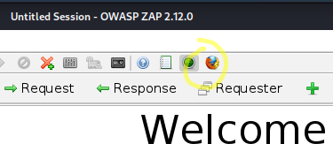

# h5

## x) https://www.bellingcat.com/resources/2021/11/01/a-beginners-guide-to-social-media-verification/

### Opas antaa hyvät eväät sosiaalisen median kautta leviävien kuvien alkuperän ja levityksen tarkoitusperien selvittämiseen.

#### 

Väärennettyjä tai väärässä kontekstissa esitettyjä kuvia ja videoita levitetään erityisesti salaliittopiireissä.

Kuvan alkuperän selvittämiseen on muutama hyvä nyrkkisääntö:

1. Alkuperä: liittyykö kuva todella siihen liitettyyn tapahtumaan? Onko kuva esimerkiksi uutislähetyksestä? Onko uutislähetys uudelleenkäyttänyt vanhaa materiaalia?

2. Kuka? Kuka kuvaa levittää? Missä kuva on julkaistu? Onko kuvan levittäjä todellinen henkilö vai anonyymi - vai botti?

3. Missä? Missä kuva on otettu? Onko kuvan sijainti yhdistettävissä siihen liitettyyn tapahtumaan?

4. Koska? Milloin kuva on otettu? Kun kuvan alkuperäinen sijainti on selvitetty, voidaan kuvasta ehkä päätellä vuorokaudenaika. Onko se sama kuin siihen liitetty tapahtuma? 

5. Miksi? Miksi kuva on jaettu? Onko kuvan jakajalla jokin selkeä agenda? Onko kuvan jakanut taho luotettava?

Esimerkkitapauksena video, jota jaettiin laajalti Telegramissa: maaliskuussa 2021 Ever Given -niminen rahtilaiva jumittui Suezin kanaaliin. Hyvin pian tämän jälkeen QAnon -salaliittopiireissä alkoi pyöriä väitetysti Ever Greenillä kuvattu video rahtikontista, jota arveltiin käytettävän lapsien salakuljetukseen (:D). Videossa oli TikTokille tyypillinen kuvaan poltettu käyttäjänimitagi, ja yksinkertainen haku TikTokin verkkosivuilla paljasti, että kyseessä ei ollut lapsien salakuljetukseen liittyvä kontti (:D), vaan kaivoksteollisuuden käyttämä hätäsuojayksikkö.

## y) Suomi-OSINT -lähteitä

#### Suomen oma sosiaalinen media kasvoi IRC-kulttuurin ympärille 2000-luvun alussa, ja osa näistä sosiaalisista medioista on vieläkin käytössä - ei tosin aktiivisessa, mutta kuitenkin. 

Hyviä lähteitä: 

- https://irc-galleria.net/ - verrattain aktiivinen kuvayhteisö, jonka tarkoituksena oli aikoinaan tuoda irc-keskusteluryhmien nimimerkkien kasvot muiden nähtäville

- https://ircquotes.fi/ - irc:n käyttäjille suunnattu hauskojen keskustelunpätkien jakamiseen tarkoitettu palvelu. Keskusteluita voi hakea esimerkiksi nimimerkin perusteella.

IRC:ssä käytettyjä nimimerkkejä pystytään yhdistämään todellisiin henkilöihin käyttämällä em. lähteitä yhdessä esimerkiksi Facebookin, Instagramin, Twitterin ja Linkedinin kaltaisia sosiaalisen median alustoja. 

## a) OWASP ZAP

Zapista löytyi valmis Debian-paketti, joten sen asennus onnistui Kali Linuxissa helposti komennolla

    sudo apt-get install zaproxy 

Proxyn kanssa webin selailu on tehty Zapissa helpoksi. Selaimen ja proxyn voi avata painamalla oletusselaimen kuvaketta työkaluvalikosta:

Kokeilen avata WebGoatin palvelimeltani: 

Zap näyttää kaappaavan liikennettä ongelmitta. 

## b) OWASP ZAP: TLS

Arvelutti, voiko Zapin kanssa töhöillä jos ei tee muuta kuin kaappaa normaalia web-surffailua. No, ei voi: 

https://www.zaproxy.org/faq/is-there-any-danger-when-scanning-with-zap-against-a-live-website-e-g-create-delete-update-corrupt-data/

Laitan kuitenkin *varmuuden vuoksi* ZAPin safe modeen:

Kokeilen avata proxytetyllä selaimella osoitteen https://ircquotes.net. Sivu aukeaa ongelmitta, ja näyttää käyttävän ZAPin omaa certiä:

Vastaus requestiin näyttää palautuvan http-muodossa eli salaamattomana:

## c) Mitmproxy

Kali Linuxissa on jo Mitmproxy valmiiksi asennettuna, joten sitä ei tarvitse erikseen asennella. 

Käynnistetään Mitmproxy porttin 8080. Se onnistuu komennolla `mitmproxy -p 8080`:

Asensin Mitmproxyn käyttöä varten Firefoxiin Teron suositteleman FoxyProxy -lisäosan. Sen konffaus omaan proxyyn on suoraviivaista:

Avaan omalla palvelimellani asustavan Webgoatin ja Mitmproxy saa kaapattua liikennettä:

## d) Totally Legit Sertificate: TLS-liikenne ja Mitmproxy

Avatessa https-sivun Mitmproxyn läpi, salaus ei toimi:

Ilmeisesti tässä pitäisi änkeä oma certti yhteyden väliin, jotta salaus "toimisi". Mitmproxylla on hyvät dokumentaatiot, ja löysin sieltä näppärät ohjeet oman certin käyttämiseen.

(https://docs.mitmproxy.org/stable/concepts-options/ , kohta 'certs')

Generoidaan seuraavaksi oma avain ja certti. Se onnistuu Linuxissa seuraavilla komennoilla:

    openssl genrsa -out ca.key 2048
    openssl req -new -x509 -key ca.key -out ca.crt
    cat ca.key ca.crt > ca.pem 

Viimeinen komento yhdistää avaimen ja certin yhteen tiedostoon nimeltään 'ca.pem'. Tämä on certti, jota aion käyttää Mitmproxyn kanssa. 

Mitmproxyssa voi käyttää yhtä certtiä kaikelle liikenteelle. Se tapahtuu laittamalla tähtimerkin certin domainohjaukseen. Käynnistän tätä logiikka noudattaen Mitmproxy uudestaan, tällä kertaa oman certini kanssa, eli komennolla `mitmproxy --certs *=ca.pem -p 8080`

Ei toimi. Firefox valittaa certin ongelmasta:

Certti näyttäisi toimivan, mutta itse allekirjoitettu. Saisikohan Mitmproxyn jotenkin olemaan varmistamatta certtejä? 

Mitmproxyn dokumentaatiosta löytyy 'ssl_insecure' -flagi. Sen kuvauksessa sanotaan: 

*Do not verify upstream server SSL/TLS certificates.*

Tämä taitaa olla juuri sitä mitä haluan tehdä. Kokeillaanpa. Käynnistän Mitmproxyn uudestaan, tällä kertaa komennolla `mitmproxy --certs *=ca.pem --ssl_insecure=true -p 8080`

Väsymys alkaa jo näkyä omassa tietokoneen käytössä:

Mitmproxy käynnistyy vihdoin komennolla `mitmproxy --certs *=ca.pem --ssl-insecure -p 8080`

Tälläkään kertaa ei onnistu. Firefox valittaa:

Olisiko certin luomisessa mennyt jokin mönkään? Kokeilen luoda sen uudestaan, mutta tilanne ei muutu. HSTS:n kiertämiseen on varmasti keinoja, mutta se vaikuttaa ylimääräiseltä säädöltä: https://www.maxivanov.io/http-strict-transport-security/

Teoriassa homma olisi voinut toimia, jos olisin valinnut jonkin muun domainin kuin Google.com. Kokeilen vielä sitä. Luon uuden certin uudelle domainille.

Kokeilin ircquotes.fi ja pari muuta domainta, mutta en saanut toimimaan. Jotain omassa toiminnassa mättää, mutta en tajua mikä.

